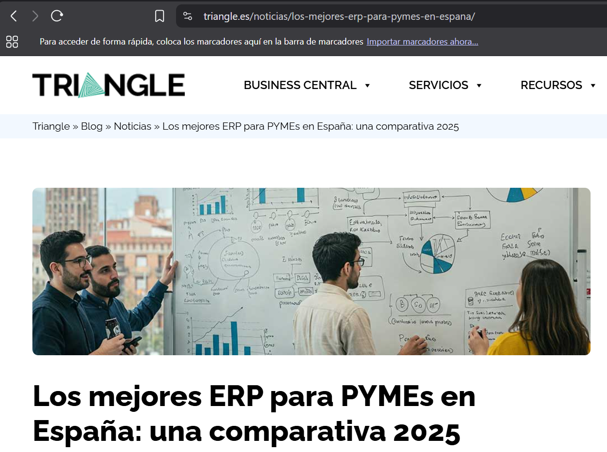
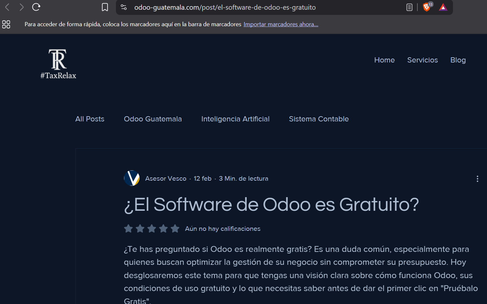
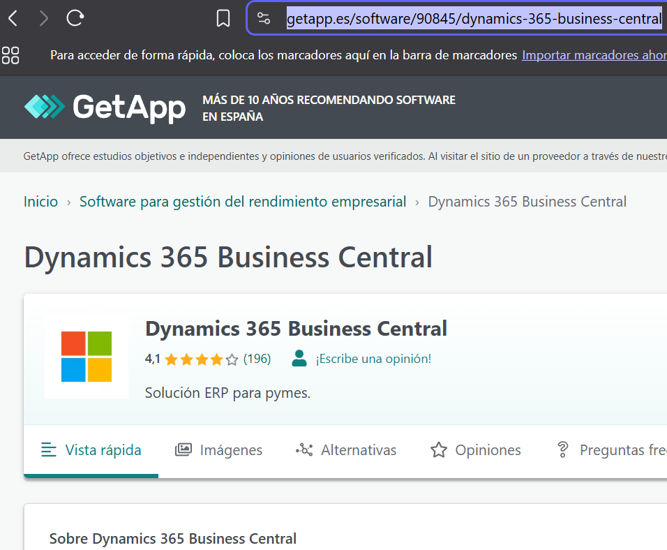
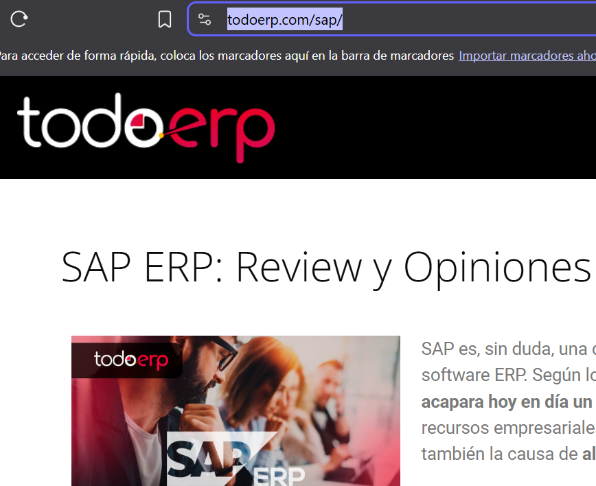

## **Índice**

- [Análisis de los ERPs elegidos](#análisis-de-los-erps-elegidos)
- [Casos en los que elegirías esos ERPs](#casos-en-los-que-elegirías-esos-erps)
- [Tabla Comparativa ERPs](#tabla-comparativa-erps)
- [Conclusiones para el caso concreto(Elección de ERP y porque)](#conclusiones-para-el-caso-concretoelección-de-erp-y-porque)
- [Fuentes y evidencias Requisitos de documentación oficial/artículos técnicos y capturas con URL visible.](#fuentes-y-evidencias-requisitos-de-documentación-oficialartículos-técnicos-y-capturas-con-url-visible)

# Análisis de los ERPs elegidos

###### *Microsoft Dynamics 365 Business Central*

Este es un ERP ideal para las empresas en crecimiento ya que puedes empezar con lo básico e ir añadiendo posteriormente módulos. Además tiene la ventaja de que se implementa muy bien con Microsoft: Office 365. Tiene los siguientes módulos según la edición:

| **Categoría / Módulo**                   | **Edición Essentials**                        | **Edición Premium**                                       |
| :------------------------------------------- | :----------------------------------------------- | :----------------------------------------------------------- |
| **Gestión financiera / Contabilidad**     | Libro mayor, bancos, activos, presupuestos     | Idem Essentials                                            |
| **Ventas / CRM**                           | Clientes, cotizaciones, pedidos, facturas      | Idem Essentials                                            |
| **Compras / Proveedores**                  | Proveedores, órdenes, facturas, devoluciones  | Idem Essentials                                            |
| **Inventario / Almacén**                  | Control de stock, ubicaciones, lotes, series   | Idem Essentials                                            |
| **Fabricación / Producción (MRP)**       | No incluido                                    | Producción, BOM, planificación, control de capacidad     |
| **Gestión de proyectos / Recursos**       | Presupuestos, tiempos, facturación            | Idem Essentials                                            |
| **Gestión de servicios / Mantenimiento**  | No incluido                                    | Contratos, reparaciones, garantías, historial de servicio |
| **Recursos Humanos**                       | No incluido nativo (extensiones opcionales)    | No incluido nativo                                         |
| **Gestión documental**                    | Integración básica con SharePoint / OneDrive | Idem Essentials                                            |
| **Analítica / BI**                        | Power BI embebido, informes estándar          | Idem Essentials                                            |
| **Integración Microsoft 365**             | Outlook, Teams, Excel, OneDrive                | Idem Essentials                                            |
| **Localización España (SII, AEAT, IVA)** | Incluida oficialmente                          | Incluida oficialmente                                      |
| **Despliegue**                             | Nube (Azure SaaS) o local (partners)           | Nube o local                                               |
| **Marketplace / Extensiones**              | Microsoft AppSource                            | Microsoft AppSource                                        |

Además tiene una personalización muy profunda, lo cuál requiere partners especializados lo cuál eleva el coste y tiempo, este es un ERP robusto, complejo para usuarios sin experiencia en ERPs.

###### *SAP Business One*

Este es también un ERP muy robusto y escalable con ampliación de usuarios, de complejidad etc. Sus módulos vienen preconfigurados, es de un alto costo tanto en la licencia como en la implementación, es un ERP muy complejo, puede ser excesivo si la empresa tiene necesidades básicas ofreciendo los siguientes módulos:

| **Categoría / Módulo**                   | **SAP Business One (SQL)**                  | **SAP Business One HANA (Avanzado)**     |
| :------------------------------------------- | :-------------------------------------------- | :----------------------------------------- |
| **Gestión financiera / Contabilidad**     | Libro mayor, cuentas, activos, presupuestos | Idem + analítica en tiempo real         |
| **Ventas / CRM**                           | Cotizaciones, pedidos, facturas, socios     | Idem + analítica avanzada               |
| **Compras / Proveedores**                  | Órdenes, facturas, devoluciones            | Idem + automatización avanzada          |
| **Inventario / Almacén**                  | Multi-almacén, lotes, series, FIFO/LIFO    | Idem + dashboards HANA                   |
| **Producción / MRP**                      | Órdenes, BOM, planificación de materiales | Idem + optimización predictiva          |
| **Gestión de proyectos**                  | Tareas, hitos, presupuestos                 | Idem + informes en tiempo real           |
| **Recursos Humanos**                       | Gestión básica de empleados               | Idem                                     |
| **Gestión de servicios / postventa**      | Contratos, llamadas, mantenimiento          | Idem + analítica predictiva             |
| **Gestión de activos fijos**              | Integrada con contabilidad                  | Idem                                     |
| **Tesorería / Bancos**                    | Conciliaciones, pagos, cobros               | Idem                                     |
| **Informes / Analítica / BI**             | SAP Crystal Reports                         | SAP HANA Analytics + Dashboards          |
| **Localización España (SII, IVA, AEAT)** | Incluida oficialmente                       | Incluida oficialmente                    |
| **Despliegue**                             | Local o nube (partners)                     | Local o SAP Cloud                        |
| **Marketplace / Add-ons**                  | SAP Store (add-ons estándar)               | SAP Store + soluciones certificadas HANA |

###### *Odoo*

Con este ERP puedes empezar con lo que necesites y posteriormente ir ampliando gracias a su modularidad. Es de código abierto lo que permite una amplia personalización de los módulos a medida. Odoo ofrece una versión gratuita llamada Community Edition, esta versión permite acceder a una sola aplicación específica de forma ilimitada y gratuita para siempre, con un número ilimitado de usuarios. Las aplicaciones que pueden usarse gratuitamente incluyen contabilidad (básica), facturación, CRM, gestión de proyectos, inventario, punto de venta (POS), sitio web y comercio electrónico además de incluir una base de datos de prueba de 15 días y mantenimiento incluido. Las diferentes versiones de Odoo ofrecen los siguientes módulos:

| **Categoría / Módulo**                   | **Odoo Community (Gratuita)**            | **Odoo Enterprise (Comercial)**                                            |
| :------------------------------------------- | :----------------------------------------- | :--------------------------------------------------------------------------- |
| **Gestión financiera / Contabilidad**     | Facturación básica, IVA, pagos, cobros | Contabilidad completa, multiempresa, multimoneda, informes, analítica     |
| **Ventas / CRM**                           | CRM con pipeline básico, presupuestos   | CRM avanzado, cotizaciones, pedidos, facturas, seguimiento de clientes     |
| **Compras / Proveedores**                  | Órdenes de compra básicas              | Compras completas, recepción, devoluciones, integración con inventario   |
| **Inventario / Almacén**                  | Control básico de existencias           | Multi-almacén, trazabilidad, lotes, códigos de barras, rutas logísticas |
| **Fabricación / MRP**                     | No disponible                            | MRP, listas de materiales, planificación, mantenimiento y calidad         |
| **Gestión de proyectos**                  | Tareas y kanban básico                  | Costes, hitos, facturación por proyecto, seguimiento de tiempo            |
| **Recursos Humanos / Nóminas**            | Gestión básica de empleados            | RRHH completo: ausencias, asistencia, nóminas, gastos, evaluaciones       |
| **Punto de venta (POS)**                   | Disponible                               | Integrado con inventario y contabilidad                                    |
| **Gestión de servicios / Helpdesk**       | No disponible                            | Tickets, mantenimiento, SLA, servicio posventa                             |
| **Gestión documental / Firma digital**    | Adjuntos simples                         | Gestión documental avanzada, aprobaciones, firma electrónica             |
| **Comercio electrónico / Portal web**     | Tienda y web básicas                    | eCommerce completo, portal de cliente, integración con pagos              |
| **Informes / Analítica / BI**             | Informes estándar                       | Tableros avanzados, KPIs, gráficos, personalización total                |
| **Localización España (SII, IVA, AEAT)** | Disponible vía módulos externos        | Incluida oficialmente                                                      |
| **Despliegue**                             | Local o servidor propio                  | Nube (Odoo.sh / SaaS) o local                                              |
| **Marketplace / Apps externas**            | Odoo Apps (gratuitas y de terceros)      | Odoo Apps + certificadas y soporte oficial                                 |

Tiene una interfaz muy moderna cuidando bien la experiencia de usuario, La versión Enterprise requiere un pago el cuál puede subir según el número de apps y usuarios. La personalización muy avanzada requiere de partners con experiencia, no es tan robusto como otro ERPs.

# **Casos en los que elegirías esos ERPs**

- **Microsoft Dynamics 365 Business Central**

Esta opción es ideal para empresas con previsión de crecimiento y con herramientas de Microsoft para aprovechar las herramientas e implementaciones, y con operaciones complejas de ventas, compras, inventario, proyectos etc.

- **SAP**

Es ideal para empresas con operaciones complejas que busquen invertir en la robustez, estabilidad y capacidad de crecimiento dispuestas a invertir a formación y soporte técnico desde un inicio.

- **Odoo**

Este ERP es ideal para empresas pequeñas que quiern empezar sin hacer una gran inversión inicial y necesitan algo más personalizado y adaptado a ellos, que no tienen operaciones muy complejas perosí cubrir muchas áreas de gestión.

# **Tabla Comparativa ERPs**

| Criterio                         | Odoo                                                                                                                                    | Microsoft Dynamic 365 Business Central                                                                     | SAP Business Central                                                                                                             |
| :--------------------------------- | ----------------------------------------------------------------------------------------------------------------------------------------- | ----------------------------------------------------------------------------------------------------------------- | ---------------------------------------------------------------------------------------------------------------------------------- |
| Despliegue (nube/local)          | Opciones de nube, local (“on-premise”) y hospedaje oficial (Odoo.sh).                                                                 | Enfoque “cloud-first” con posibilidades de local o híbrido vía partners.                                    | Permite despliegue on-premise, en la nube y modelos híbridos.                                                                   |
| Facilidad de uso                 | Interfaz moderna, modular; pensado para usuarios finales; el cliente puede activar solo lo necesario.                                   | Interfaz moderna y familiar para usuarios de Microsoft; uso común de herramientas Office.                      | Interfaz funcional pero algo más tradicional; personalizable, pero curva de aprendizaje mayor.                                  |
| Personalización/Integración    | Muy alta: open-source, APIs, módulos, personalización libre.                                                                          | Alta: extensiones, apps de AppSource, integración profunda con Microsoft 365 y Power Platform.                 | Alta: SDK, add-ons, partners; es extensible, aunque modificaciones profundas pueden requerir más esfuerzo.                      |
| Seguridad/RGPD                   | En modos nube/local el cliente tiene control total; Odoo.sh ofrece mecanismos de respaldo, redundancia.                                 | Soporte de Microsoft Azure aporta estándares de seguridad certificados (cifrado, accesos, cumplimiento).       | SAP trabaja con estándares globales de seguridad; versiones localizadas implican adaptación normativa.                         |
| Cobertura por procesos           | Gran abanico: contabilidad, ventas, compras, inventario, CRM, recursos humanos, eCommerce, etc.                                         | Completo: finanzas, operaciones, cadena de suministro, proyectos, servicio, manufactura ligera.                 | Amplio: finanzas, compras, ventas, inventario, producción, logística, con módulos robustos.                                   |
| Ecosistema/Soporte               | Comunidad activa + soporte oficial en versión empresarial + red de desarrolladores.                                                    | Red global de partners Microsoft, fuertes recursos de soporte y ecosistema de aplicaciones.                     | Amplia red de partners certificados, soporte oficial SAP, formación y certificaciones.                                          |
| Coste total estimado             | Bajo a moderado en versiones base; los costes de implementación / personalización pueden subir.                                       | Modelo de licencias por usuario (mensual/anual); coste moderado-alto en escenarios complejos.                   | Licencias “Professional” y “Limited” (y modelos perpetuos o de suscripción); costes elevados de entrada en muchos casos.    |
| Escalabilidad                    | Escalable, aunque para volúmenes muy grandes puede requerir infraestructura robusta.                                                   | Altísima escalabilidad gracias a la infraestructura de nube de Microsoft.                                      | Buena escalabilidad; SAP promueve que Business One “crece contigo”.                                                            |
| Puntuación ponderada (opcional) | Personalizaciones complejas pueden requerir mucho desarrollo; soporte local puede depender del partner; en nube depender del proveedor. | Si se abusa de personalizaciones, la complejidad puede aumentar; dependencias de partner para implementaciones. | Costes iniciales altos; actualizaciones y migraciones pueden ser difíciles; rígido ante cambios radicales fuera del estándar. |

# **Conclusiones para el caso concreto(Elección de ERP y porque)**

Para este caso creo que lo más sensato es elegir Odoo Enterprise, ya que con este y sus módulos pueden registrar clientes sin duplicados y llevando historial de asistencias y pagos.

Para el control de reservas existen los módulos de Calendario, Reservas y Membership, lo cual permite gestionar las clases, entenamientos, confirmaciones automáticas, cancelaciones y cambios.

El módulo de POS y ventas se conecta con el inventario en tiempo real, además el módulo de Inventario trae alertas de reposición automática y gestión de proveedores eliminando así las libretas.

Tiene la posibilidad de emitir facturas electrónicas y registrar pagos automáticos.

Se pueden establecer roles y permisos para la función de cada trabajador con un flujo de notificaciones internas sin pérdida de datos.

Con todo esto, al ser una empresa pequeña pueden tomar únicamente los módulos necesarios y si tienen previsto el crecimiento pueden ampliar los módulos como otros de marketing, además no tienen operaciones muy complejas como empresas más corporativas o financieras, por lo que creo que Odoo es la mejor elección siendo personalizable, más intuitivo y completo.

# **Fuentes y evidencias Requisitos de documentación oficial/artículos técnicos y capturas con URL visible.**

[Triangle.es](https://www.triangle.es/noticias/los-mejores-erp-para-pymes-en-espana/)

[Odoo Guatemala](https://www.odoo-guatemala.com/post/el-software-de-odoo-es-gratuito)

[GetApp](https://www.getapp.es/software/90845/dynamics-365-business-central)

[todoerp](https://todoerp.com/sap/)

Además he usado [ChatGPT](https://chatgpt.com/) para las comparativas usando la información de estas páginas indicando comparaciones con las fuentes oficiales de cada ERP para sacar lo más fiel de cada artículo, aquí dejo los prompts usados:

"Quiero que uses la información de esta fuente y las siguientes que te vaya pasando y compares y analices las erps que aparecen, compara la información con las fuentes oficiales de cada ERP https://www.triangle.es/noticias/los-mejores-erp-para-pymes-en-espana/"

Con este prompt y la información recogida de las fuentes que busqué iba comparando para sacar la información más pura posible.
